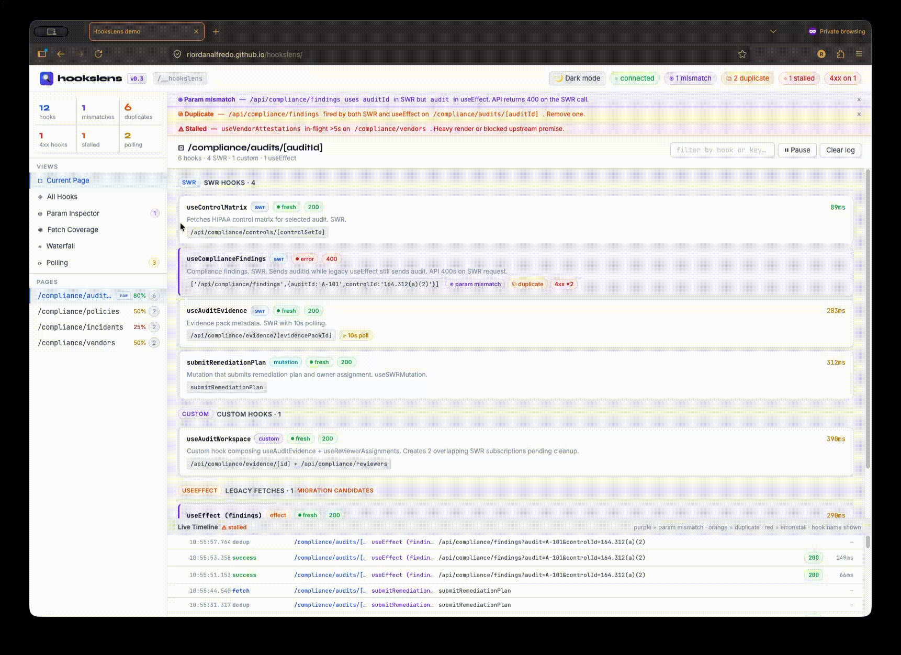
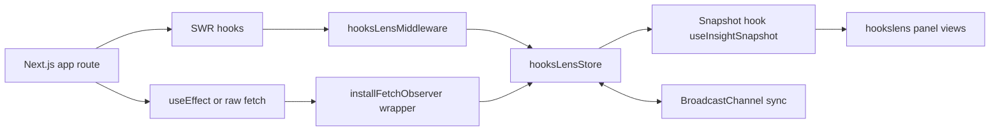

<div align="center">

# 🔍 HooksLens

**Developer DevTools for SWR and fetch behavior in Next.js apps**

[](https://github.com/riordanalfredo/hookslens)
[](https://www.npmjs.com/package/hookslens)
[](./LICENSE)
[](https://riordanalfredo.github.io/hookslens/)

[Demo](https://riordanalfredo.github.io/hookslens/) • [Installation](#installation) • [Documentation](#quick-start) • [Contributing](CONTRIBUTING.md)

</div>

---

<div align="center">



_Real-time monitoring of fetch operations and SWR hooks_

</div>

## ✨ Features

HooksLens provides real-time insights into your SWR hooks and fetch operations. Open `/hookslens` in development to access:

- 🎯 **Active Hook Monitoring** – Track hook keys and instance counts
- 🛣️ **Route-Level Filtering** – Focus on specific routes in your app
- ⏱️ **Polling Detection** – Identify hooks with polling intervals
- 🚀 **In-Flight Tracking** – Monitor active requests
- 📊 **Timeline Events** – Visualize fetch sequences with flagged duplicates/mismatches
- 🔗 **Connection Status** – Real-time diagnostics and health badges

---

## 🎨 What's Inside

The HooksLens dashboard/panel includes:

| Component          | Description                                                   |
| ------------------ | ------------------------------------------------------------- |
| **Topbar**         | Theme toggle, live connection state, diagnostic indicators    |
| **Sidebar**        | Statistics grid and route navigation                          |
| **Registry Table** | Hook status, instance counts, polling intervals, fetch timing |
| **Timeline Panel** | Event visualization with filtering and flagged patterns       |

> **Note:** Theme preferences are automatically persisted in `localStorage`.

---

## 🏗️ Architecture

```text
src/
  app/hookslens/
    page.tsx
    panel.css
    components/
      Topbar.tsx
      Sidebar.tsx
      HooksTable.tsx
      TimelinePanel.tsx
    hooks/
      useInsightSnapshot.ts
    lib/
      format.ts
  lib/
    hookslens/
      store.ts
      middleware.ts
      fetchObserver.ts
      useHooksLens.ts
```

### Runtime Flow



---

## 🚀 Demo

<div align="center">

### **[View Live Demo →](https://riordanalfredo.github.io/hookslens/)**

</div>

A standalone mock demo is included in [hookslens-demo.jsx](./demo/hookslens-demo.jsx) for quick UI exploration.

**Demo Features:**

- Static mock data for UI preview (not connected to runtime)
- Common SWR debugging scenarios: parameter mismatches, duplicate fetches, stalled polling, concurrent requests
- Works in any React sandbox or local React app

> **Note:** The demo currently includes placeholder data. The patterns shown (duplicates, mismatches, stalling) apply to any Next.js + SWR application.

**Run locally:**

```bash
npm install
npm run demo
```

Then open the printed local URL (default: `http://127.0.0.1:5173/` or `http://localhost:5173/`).

---

## 📦 Installation

Install HooksLens in your Next.js app:

```bash
npm i hookslens --save-dev
```

**What's included:**

- `hookslens` – Runtime hooks and instrumentation
- `hookslens/panel` – Dashboard component for Next.js App Router

---

## 🔧 Quick Start

### Step 1: Configure SWR Provider

In your SWR provider, wire middleware + fetch observer:

```tsx
"use client";

import { useEffect, ReactNode } from "react";
import { SWRConfig } from "swr";
import { installFetchObserver, hooksLensMiddleware } from "hookslens";

interface SWRProviderProps {
  children: ReactNode;
}

export const SWRProvider = ({ children }: SWRProviderProps) => {
  useEffect(() => {
    if (
      typeof window !== "undefined" &&
      process.env.NODE_ENV === "development"
    ) {
      installFetchObserver();
    }
  }, []);

  const swrUse =
    process.env.NODE_ENV === "development" ? [hooksLensMiddleware] : [];

  return <SWRConfig value={{ use: swrUse }}>{children}</SWRConfig>;
};
```

**Optional:** Register custom hooks for enhanced tracking:

```ts
import { useHooksLens } from "hookslens";

useHooksLens({
  name: "useProductReviews",
  description: "Fetches reviews by productId",
  fetchKey: `/api/reviews?productId=${productId}`,
});
```

### Step 2: Add Dashboard Route

Create the HooksLens panel route in your app:

```tsx
// src/app/hookslens/page.tsx

import HooksLensPanel from "hookslens/panel";
// OR do this: import HooksLensPane from "dist/local-lib/src/app/hookslens/page"

export default function Page() {
  return <HooksLensPanel />;
}
```

Then open:

```text
http://localhost:3000/hookslens
```

> **💡 Best Practice:** HooksLens is designed for development use only:
>
> - Enable middleware conditionally in development
> - Install fetch observer only in development
> - Keep `/hookslens` routes restricted to development environments

---

## 🛠️ Development Scripts

**Available commands:**

```bash
npm install
npm run dev
npm run build
npm run build:local-lib
npm test
npm run test:watch
npm run pack:check
```

> **Note:** The local-lib panel page is auto-generated from source files via `scripts/build-local-lib.mjs`.

---

## 🧪 Testing

**Test coverage includes:**

- `useHooksLens.test.ts` – Hook registration and lifecycle
- `fetchObserver.test.ts` – Fetch interception logic
- `store.test.ts` – State management
- `middleware.test.ts` – SWR middleware integration

**Supported patterns:**

```
src/**/__tests__/**/*.{test,spec}.{ts,tsx}
src/**/*.{test,spec}.{ts,tsx}
```

**Commands:**

```bash
npm test              # Run once (CI/publish-safe)
npm run test:watch    # Watch mode
npm run test:ui       # Interactive UI
```

---

## 🔗 Related Tools & Research

HooksLens builds upon the React and network debugging ecosystem with a focus on SWR + Next.js hook-flow visibility.

**Complementary tools:**
| Tool | Focus | Link |
|------|-------|------|
| **React DevTools** | Component & hooks inspection | [docs](https://react.dev/learn/react-developer-tools) |
| **SWR** | Cache & revalidation | [docs](https://swr.vercel.app/docs/getting-started) |
| **SWR Middleware** | Extension point (used by HooksLens) | [docs](https://swr.vercel.app/docs/middleware) |
| **Chrome DevTools** | Network request debugging | [docs](https://developer.chrome.com/docs/devtools/network) |
| **OpenTelemetry JS** | Observability patterns | [docs](https://opentelemetry.io/docs/languages/js/) |

**What makes HooksLens unique:**

- 🎯 Shows hook registration **intent**, not just request outcomes
- 📊 Dedicated SWR-centric panel for cross-hook fetch flow analysis
- 🛣️ Route-level debugging context for Next.js apps
- ⏱️ Timeline visualization with duplicate/mismatch detection

---

## ⚠️ Known Limitations

| Limitation                 | Description                                                                  |
| -------------------------- | ---------------------------------------------------------------------------- |
| **Development-only**       | Designed for local/staging diagnostics, not production telemetry             |
| **Causality depth**        | Shows sequence and overlap, not full dependency-cause graphs                 |
| **Browser API dependency** | Cross-tab sync uses BroadcastChannel (graceful degradation when unavailable) |
| **Client-side focus**      | Tracks browser fetch calls; server-side patterns not fully represented       |
| **Manual baseline**        | Missing hook detection is visual/observational without custom assertions     |

### When NOT to Use HooksLens

HooksLens may not be the right tool if you need:

- ❌ Production-grade distributed tracing across backend services
- ❌ Support for non-Next.js apps without SWR
- ❌ Rendering performance profiling (use React Profiler instead)
- ❌ Zero runtime instrumentation in development
- ❌ Debugging server actions, server components, or non-fetch transports (e.g., GraphQL over custom clients)

---

## 🗺️ Roadmap

Our focus is on closing critical debugging gaps:

- [ ] **Revalidation Cause Tracing**
      Annotate events with trigger sources (focus, reconnect, interval, mutate, mount, key change)

- [ ] **Effect Trigger Context**
      Capture lightweight cause hints for external fetches (route transitions, visibility changes, user actions)

- [ ] **Expected Hook Baseline Checks**
      Define expected hook presence per route and flag missing hooks after refactors

- [ ] **CI-Safe Regression Summary**
      Export diagnostics snapshots for PR checks to catch unexpected hook disappearance and duplicate patterns

---

## 🤝 Contributing

We welcome contributions! Please see our [Contributing Guide](CONTRIBUTING.md) for details.

---

## 📄 License

This project is licensed under the terms specified in the [LICENSE](LICENSE) file.

---

## 🤖 GenAI Disclosure

Parts of this project were developed with assistance from generative AI tools, including Claude.

---

<div align="center">

**[⬆ Back to Top](#-hookslens)**

</div>
